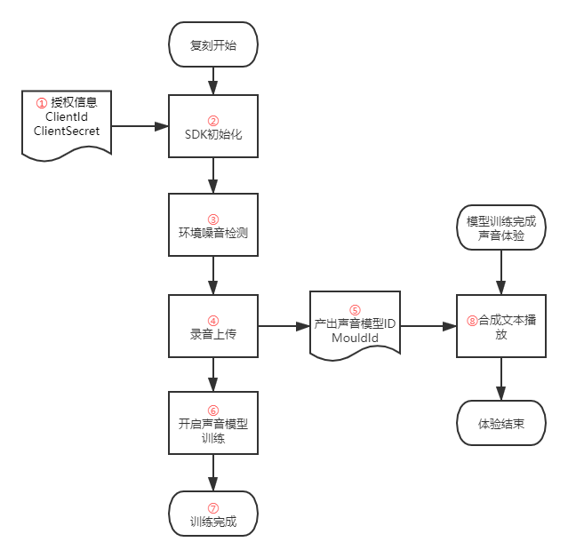

[TOC]


## 1. 复刻流程说明：




1. 整个复刻体验闭环包含两个模块，一个模块是录音上传服务器进行声音模型训练，产出声音模型ID，另一个模块是根据声音模型ID去合成服务器合成，产出声音文件，播放声音文件完成体验。
2. 此（复刻）SDK仅支持第一个模块的功能，即②③④⑤⑥⑦等功能。第二个体验的模块⑧，我们提供2种集成方式供选择，以便实现实际项目中的需求。参考3.6的说明。

## 2. XCode集成lib（参考demo） 

### 2.1 兼容性说明
兼容性：系统：iOS 9以上版本  

CPU架构：arm64 arm64e armv7 armv7s

添加隐私麦克风权限：Privacy - Microphone Usage Description：使用麦克风检测声音

### 2.2 将framework添加到项目project的目录下面

```ruby
Pod DBAudioSDK/DBVoiceEngraverKit ,'xxx' ；  xxx 指SDK的版本号；
```

### 2.3 引用SDK的头文件

`#import <DBVoiceEngraver/DBVoiceEngraverManager.h>`// 声音复刻头文件

`#import <DBVoiceEngraver/DBVoiceDetectionUtil.h>` //噪声检测头文件

SDK关键类：

| 类接口名称 | 说明 |
|--------|--------|
|DBVoiceDetectionUtil.h| 声音检测工具类，负责噪声检测 |
|   DBVoiceDetectionDelegate.h     |   回调声音检测的结果和录音时音量的结果    |
|     DBVoiceEngraverEnumerte.h   |  包含复刻SDK中的错误枚举      |
|   DBVoiceModel.h   |    复刻成功后返回的声音模型    |
| DBTextModel.h |    包含朗读的文本信息，和朗读后音频的检测结果以及音频路径等信息    |

## 3.调用方法说明
**为保证效果，请注意以下事项：**

1.  用户的Session存在有效期，精品复刻的有效期为3天，普通复刻的有效期为3个小时，请提醒用户在开启录制后，在有效期内完成录制；
2. 录音前强烈建议设置2s的倒计时，倒计时内保持安静；

### 3.1 开启声音复刻的流程

1. 实例化`DBVoiceDetectionUtil`检测噪声,并遵守相关代理，在代理回调中处理噪声检测的结果；
2. 点击开始复刻，并获取复刻文本，获取成功后进入朗读文本页面；
3. 实例化`DBVoiceEngraverManager`单例对象，并传入文本开始声音复刻；
4. 开始朗读文本；
5. 结束朗读文本；
6. 上传文本并进行准确率识别；
7. 录制完成，填入相关信息并开始录制；
8. 根据queryId 或者modelId 获取复刻后的声音；
9. 选择相应的声音模型进行声音体验;

### 3.2 回调block参数说明
| 名称 | 参数 |说明 |
|--------|--------|--------|
|    DBMessageHandler    | `NSString *msg` | **成功的回调，以字符串的形式回调结果，此处回调为服务端返回的数据** |
|   DBVoiceRecogizeHandler   |   `DBVoiceRecognizeModel *model`   | 识别成功的回调 status：1：上传识别成功；0：上传识别失败; percent: 声音的准确率       |
| DBTextBlock |  `NSArray <NSString *> *textArray`  |    获取需要朗读的文本    |
|    DBSuccessModelHandler    |    `NSArray<DBVoiceModel *> *array`    |       获取训练成功的声音模型Id|
| DBSuccessOneModelHandler | `DBVoiceModel *voiceModel` | modelStatus：2：录制中 3：启动训练失败 4：训练中 5： 训练失败 6： 训练成功 modelId: 模型Id，每个声音对应一个模型Id |
| DBFailureHandler | `NSError *error` | 错误信息，信息封装在userInfo的字段中 |
### 3.3 DBVoiceDetectionDelegate说明

| 方法名称 | 参数说明 |
|--------|--------|
|    `- (void)dbDetecting:(NSInteger)volumeDB`    |    回调声音检测到的分贝值`volumeDB`：检测到音量的分贝值    |
| `- (void)dbDetectionResult:(BOOL)result value:(NSInteger)volumeDB` | 噪声检测的最终结果回调 `result`: 1：检测成功 0：检测失败 volumeDB:检测到音量的分贝值 |

### 3.4 DBVoiceDetectionUtil的调用说明

| 方法名称 | 使用说明 |
|--------|--------|
|  `-(DBErrorState)startDBDetection`    |   1.遵循相关的代理，并实现相关的代理方法； 2.开启噪声检测，如果开启成功，返回值为`DBErrorStateNOError`;   |

### 3.5 DBVoiceEngraverManager的调用说明

| 方法名称 | 使用说明 |
|--------|--------|
| `- (void)setupWithClientId:(NSString *)clientId clientSecret:(NSString *)clientSecret queryId:(nullable NSString * )queryId rePrintType:(DBReprintType)reprintType successHandler:(DBMessageHandler)successHandler failureHander:(DBFailureHandler)failureHandler` |   1.设置`clientId,clientSecret;queryId，successHandler，failureHandler`初始化的时候设置；2.`queryId`为可选项，可以通过它来批量查询复刻后的`modelId`; 3.`clientId,clientSecret`为授权信息，需联系标贝公司获取  4.`successHandler`回调结果，默认为空 5. `failureHandler`：回调失败结果. <br>5.`rePrintType`:复刻类型   |
| `- (void)getNoiseLimit:(DBMessageHandler)handler failuer:(DBFailureHandler)failureHandler;` | 1.获取噪音的上限，通过handler进行回调处理;<br>2.可以通过在开放平台配置噪音上限，然后按照配置进行录音处理。 |
| `- (void)getTextArrayWithSeesionId:(NSString *)sessionId textHandler:(DBTextModelArrayHandler)textHandler failure:(DBFailureHandler)failureHandler` | 1.通过`SessionId`（恢复录制），如果是首次录制，传入空字符串即可;<br>2.首次录制会在回调中返回用户的`SessionId`,后期可以根据该`SessionId`恢复中途退出的录制； |
|`- (void)setupQueryId:(nullable NSString *)queryId`| 设置查询Id，需要在执行获取sessionId前设置，此参数不是必填参数，但是强烈建议使用 queryId： 查询Id|
| `- (void)startRecordWithTextIndex:(NSInteger)textIndex messageHandler:(DBMessageHandler)messageHandler failureHander:(DBFailureHandler)failureHandler` |传入识别文本并开启录音,默认添加了一个60s时长的录音限制；`failureHandler：`如果发生错误，回调此方法|
|`- (void)stopRecord;`|结束录音，结束本次录音|
|`- (void)unNormalStopRecordSeesionSuccessHandler:(DBSuccessHandler)successBlock failureHandler:(DBFailureHandler)failureHandler`|非正常录音结束，如果用户没录音完返回需要调用此方法结束录音，不然会默认占用一个录音权限，如果长时间未调用，也会自动释放；`successBlock：`结束录音成功的回调；`failureHandler：`如果发生错误，回调此方法|
|`- (void)uploadRecordVoiceRecogizeHandler:(DBVoiceRecogizeHandler)successHandler` |上传录音文件进行识别successHandler：识别成功 1、如果发生错误，回调代理方法`- (void)dbVoiceRecognizeError:(NSError *)error`|
|`- (void)queryModelStatusByModelId:(NSString *)modelId SuccessHandler:(DBSuccessModelHandler)successHandler failureHander:(DBFailureHandler)failureHandler`|根据默认传入的modelId查询模型状态`successHandler：`查询成功，以数组的形式返回model `failureHandler：`如果发生错误，回调此方|
|`- (void)startModelTrainRecordVoiceWithPhoneNumber:(NSString * _Nullable)phoneNumber                              notifyUrl:(NSString *_Nullable)notifyUrl                          successHandler:(DBSuccessHandler)successHandler failureHander(DBFailureHandler)failureHandler`|开启模型训练；phoneNumber：手机号码 notifyUrl：用于接收复刻结果的回调url `successHandler:`开启训练成功，开启成功后会回调modelId `failureHandler：`如果发生错误，回调此方法|

### 3.6 声音复刻录制进度的控制

| 方法名称                                                     | 使用说明                                                     |
| ------------------------------------------------------------ | ------------------------------------------------------------ |
| `- (void)listenAudioWithTextIndex:(NSInteger)index;`         | 试听指定index的音频                                          |
| `- (void)stopCurrentListen;`                                 | 停止试听                                                     |
| `- (BOOL)canNextStepByCurrentIndex:(NSInteger)currentIndex;` | 1.当前的条目能否进入下一条,Yes：可以,NO:不可以; <br>2.currentIndex 当前条目的Index |

### 3.7其他方法

| 方法名称                             | 使用说明                                                     |
| ------------------------------------ | ------------------------------------------------------------ |
| `- (DBReprintType)currentType;`      | 当前的复刻类型                                               |
| `+ (NSString *)sdkVersion;`          | sdk版本                                                      |
| `+ (NSString *)ttsIPURL;`            | 获取复刻成功后模型的加载地址                                 |
| `+ (void)enableLog:(BOOL)enableLog;` | SDK的日志记录,默认为YES，YES: 开启日志记录， NO:关闭日志记录； |


### 3.7 体验复刻成功或的声音

第一种集成方式如Demo中所示，用声音模型ID + RestAPI的形式，合成MP3声音文件，进行播放。这种合成方式适用于单次不超过250字文本长度的文本合成。
另一种方式则是声音模型ID + TTS合成SDK，具体集成方式可参考我们TTS合成SDK的接入文档。这种方式无文本长度限制，实时合成流式返回，TTS合成SDK中也有播放器功能，集成使用很方便。


## 4.错误码说明
| 错误码 | 枚举状态 |含义 |
|--------|--------|--------|
|   0   | DBErrorStateNOError |   成功     |
|   90000   | DBErrorStateMircrophoneNotPermission |   麦克风没有权限     |
|900001| DBErrorStateInitlizeSDK |初始化SDK失败|
|900002|DBErrorStateFailureToAccessToken|获取token失败|
|900003|DBErrorStateFailureToGetSession|获取session失败|
|900004|DBErrorStateFailureInvalidParams|无效的参数|
|99999|DBErrorStateNetworkDataError|获取网络数据异常|
|00011|DBErrorStateTokenInvaild|token失效|
|10003|DBErrorStateFailureErrorParams|参数错误|
|10004|DBErrorStateUploadFailed|上传文件失败，请选择正确的文件格式|
|10005|DBErrorStateEmptyfile|上传文件不能为空|
|10008|DBErrorStateModuleIdInvailid|模型Id不合法|
|10009|DBErrorStateModelSyns|模型正在过程录制中，其他客户端不能同时录制！|
|10010|DBErrorStateRecognizeVoiceTimeOut|识别语音超时|
|40002|DBErrorStateMaxUploadTime|提交次数已达到最大限制|
|40003|DBErrorStateExpiredRquest|接口请在有效期内使用|
|40004|DBErrorStateRequestAuthFaild|接口签名不合法|
|40005|DBErrorStateInvaildMoile|请填写正确的手机号|
|115001|DBErrorStateEmptySessionId|传入的SessionId不能为空|
|115002|DBErrorStateParseFailed|解析网络数据失败|

